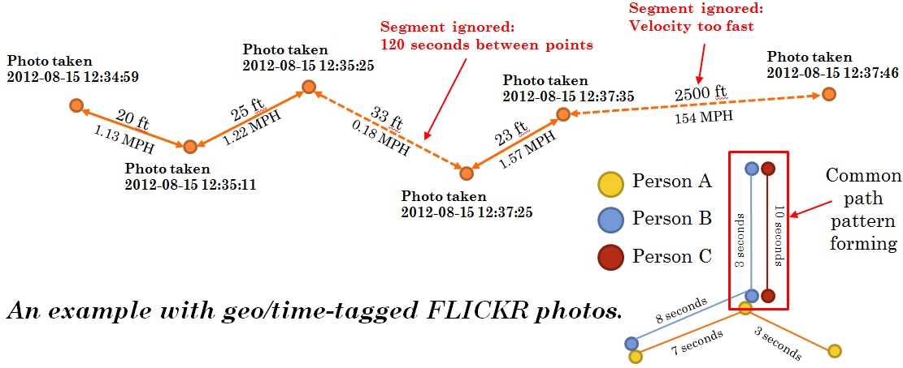

aggregate-micro-paths (AMP)
=====================

Infer movement patterns from large amounts of geo-temporal data in a cloud environment.

Description:
==

This algorithm takes as input geo-spatial data that includes time stamps and a "user id" or "track id".
The points in space and time are used to create "micro paths" if certain conditions are met
(such as time between points, and velocity of movement between points).

Track segments are then binned based on a grid (specified in conf) and aggregated to create a heat map.

Usage:
==

To get started, you can run the example on the AIS_small.csv included in the root of this project.  Run run_ais.sh to do so.

Implementation details:
==

This algorithm is implemented using HIVE with hadoop streaming.   The python file "AggregateMicroPath.py" generates and executes HQL to create data tables and execute queries.  The scripts folder contains additional python files that are used with HADOOP streaming to process the data.

