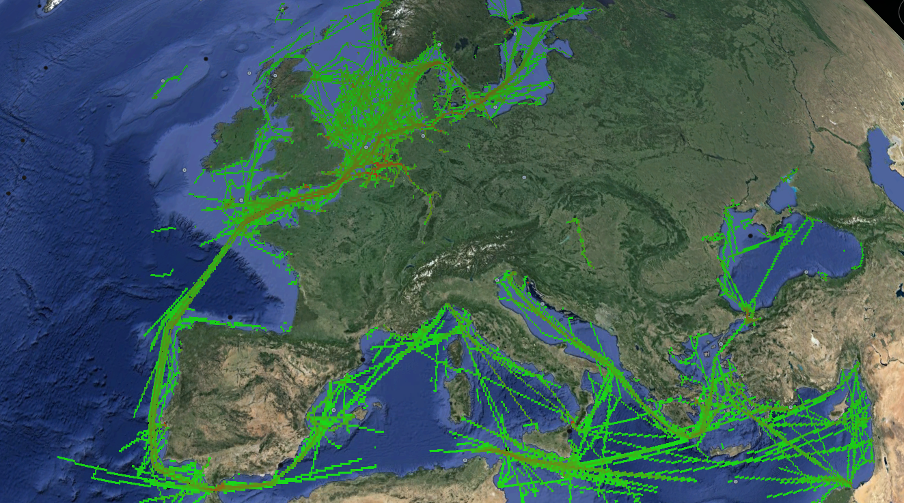

# Aggregate Micro Paths

> An analytic to help infer movement patterns from large amounts of geo-temporal data in a cloud environment.

---

## What Do You Provide?

A collection of independent entries that represent an identified object's geographic location at a given point in time.

 Key Data Fields [ ID, TIMESTAMP, LATITUDE, LONGITUDE ]

Specific formatting and analytic tool configurations for using your own data set(s) is provided within the **[wiki](https://github.com/Sotera/aggregate-micro-paths/wiki)**.

## What Does This Do?

1. Infers movement patterns based on given geo-temporal data and build tracks (or paths) of movement for each unique object in your collection.
2. Create data tables that aggregate information regarding track activity within an area, average velocity and movement of tracks, and average direction/bearing of tracks.

## What Do You Need To Know?

In order to utilize your own data sets, some knowledge of the following aspects will be required:

* **[Apache Hive](http://hive.apache.org/)** syntax
* **[Python programming language](https://www.python.org/)**

## Software Dependencies

* **[Cloudera CDH 5.13.1](http://www.cloudera.com/content/cloudera/en/products-and-services/cdh.html)**, Hadoop {streaming}
* **[Apache Hive](http://hive.apache.org/)**
* **[Python programming language](https://www.python.org/)** + gmpy2

### Quick Start

#### Example code

To run the example, execute `run_ais.sh` found in `{project-root}/hive-streaming`.  

This script will unpack the sample data, upload it to the Hadoop filesystem, enter it into Hive, and run the Aggregate Micro Pathing algorithm.  When completed, it will also pull down the finished count data from Hive and place it locally into a .csv file located in the `{project-root}/hive-streaming/output` directory.

For detailed instructions, **[go to the wiki](https://github.com/Sotera/aggregate-micro-paths/wiki)**.

## Docker

Docker image built on top of the Vadim Panov's Hadoop+Hive+Spark image, 
using his [Zeppelin image](https://hub.docker.com/r/panovvv/zeppelin-bigdata) as a model
for a container in his [BigData](https://github.com/panovvv/bigdata-docker-compose) Docker Compose cluster.

## License

AMP is distributed under the Apache 2.0 license. (See LICENSE.)

Panov's Docker configuration released under the MIT license. (See LICENSE - panovv.)
